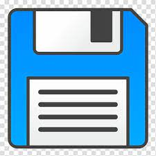

# Projekt kao 2.kolokvij iz Programiranje Na Internetu
# 

Tema ovog projekta je slaganje popisa osobe u PhoneBook-a pomoću <strong>ASP.NET Web Forms Application.</strong>

Prvo se moramo ulogirati da bi ušli u stranicu TableDesign u kojem
prikazuju popis tablica različitih imena, prezimena, kontakta i email-a pojedine osobe.
U TableDesign imamo pet različita gumba za slaganje popisa PhoneBook-a: 
- <strong>Insert</strong> ,
- <strong>Save</strong> ,
- <strong>Cancel</strong> , 
- <strong>Update</strong>  i 
- <strong>Delete</strong> , te
- gumb <strong>"Logout"</strong> za izlaz stranice.
#
#### Kako unosimo novu osobu u PhoneBook-u?
Za unos novu osobu, prvo dodajemo ime, prezime, kontakt i email. Ako smo sigurni da
su podaci ispravni, onda kliknemo na gumb "Insert " i prikazije se osoba uz podatke te 
ispisuje poruku da su uneseni podaci (eng. "New Record Added.").
Ako ne, kliknemo "Cancel " kojim se poništava unos podataka osobe.
#
#### Kako ažuriramo i spremamo podatke osobe u PhoneBook-u?
Za ažuriranje podataka neke osobe, kliknemo na gumb "Update " koji nam daje mijenjanje podataka osobe.
Ako želimo promijeniti ime, prezime, kontakt i email osobe, onda ćemo mijenjati podatke 
(npr., umjesto "Pero", "Perić", "0912548556" i "pero@perić.com" mijenjamo na "Ivan", "Ivić", "0912365488" i "ivan@ivic.com").
Ako su podaci točni, nakon promjene jedne osobe, kliknemo na gumb "Save " 
i potvrdit će promjenu podataka u tablici PhoneBook-a i sipisati poruku da su promijenjeni podaci (eng. "Selected Record Updated.")
#
#### Kako brišemo podatke osobe u PhoneBook-u?
Ako ne želimo podatke neke osobe, kliknemo na gumb "Delete ".
Podaci, koji su bili u tablici, će biti izbrisani i ispisat će poruku da su izbrisani podaci (eng. "Selected Record Deleted.")
#

Za izlaz stranice, kliknemo na gumb "Logout" i vratit će se na početnu stranicu
s porukom.